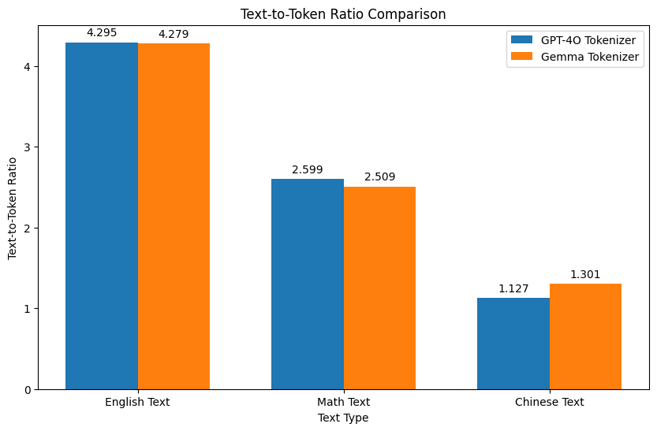

# tokenizer-101
This repo is developed along my deep-dive into the details of tokenization for LLM development, following this amazing tutorial [[Andrej Karpathy's Tutorial](https://www.youtube.com/watch?v=zduSFxRajkE)]. It heavily references this example repo [[MinBPE](https://github.com/karpathy/minbpe)].

## Constructing Tokenizer
I implemented a barebone tokenizer class structure [[Tokenizer](https://github.com/wezteoh/tokenizer-101/tree/main/core/tokenizer)] that is commonly used to translate text representation between a modality readable by LLM (tokens) and a modality readable by human (raw text). There are 3 main methods in the class:
- encode
- decode
- train

## How to try
- Install requirements and set up environment. Python 3.12 is supported.
```
pip install poetry
poetry install
source set_env.sh
```

- train a tokenizer
```
python scripts/train.py \
--train_file data/sample.txt \
--tokenizer_type regex \
--vocab_file .temp/vocab.json \
--merges_file .temp/merges.json \
--vocab_size 1000
```
- Test encode/decode with a trained tokenizer
```
python scripts/encode_decode.py \
--tokenizer_type regex \
--vocab_file .temp/vocab.json \
--merges_file .temp/merges.json
```

## Text-to-token ratio
I ran a comparison of the text-to-token ratios (length of text divided by count of tokens encoded from the text) between the gpt4o tokenizer and gemma tokenizer (the tokenizer used for the gemini series). 

In some sense, this ratio is reflecting the efficiency of a tokenization scheme --
if one token can capture longer text, we are saving model's capacity from having to model the relationships among subtext units captured by the token.

You can run similar comparison by the following command:
```
python scripts/compare_tokenizers.py --input_text_file data/sample.txt
```



## Additional References
1. The gemma tokenizer model is downloaded from the [[Gemma Repo](https://github.com/google/gemma_pytorch/tree/main)].
2. math_text.txt is extracted from the
[[MATH Repo](https://github.com/hendrycks/math)].
